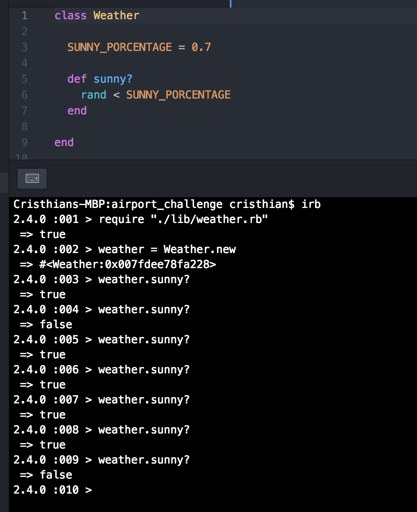
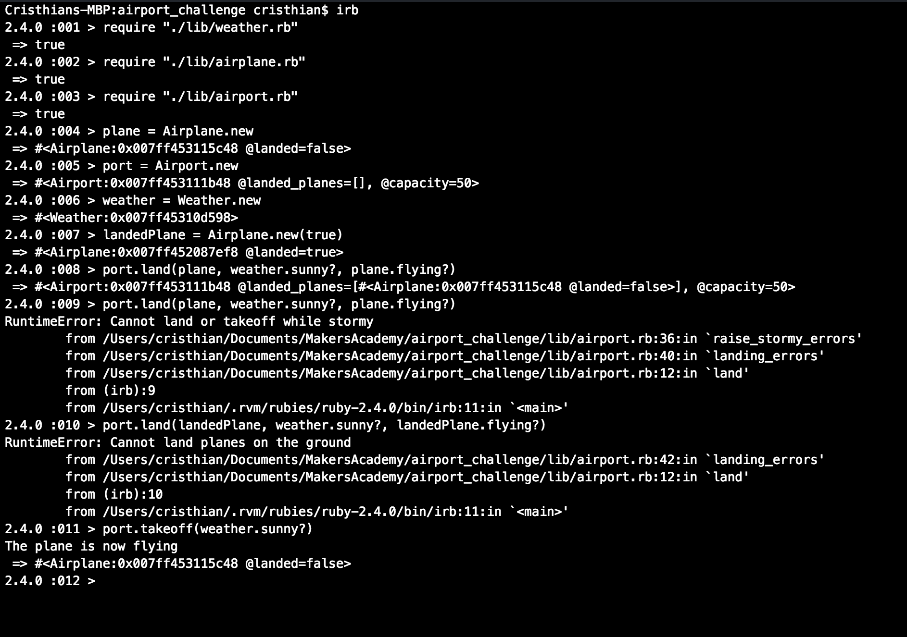

Airport Challenge
=================

This challenge was made by the MakerAcademy, here you will see what they asked us to do and how I solved it + how the code works.

```
        ______
        _\____\___
=  = ==(____MA____)
          \_____\___________________,-~~~~~~~`-.._
          /     o o o o o o o o o o o o o o o o  |\_
          `~-.__       __..----..__                  )
                `---~~\___________/------------`````
                =  ===(_________)

```
Given Task
-----

We have a request from a client to write the software to control the flow of planes at an airport. The planes can land and take off provided that the weather is sunny. Occasionally it may be stormy, in which case no planes can land or take off.  Here are the user stories that we worked out in collaboration with the client:

```
As an air traffic controller
So I can get passengers to a destination
I want to instruct a plane to land at an airport

As an air traffic controller
So I can get passengers on the way to their destination
I want to instruct a plane to take off from an airport and confirm that it is no longer at the airport

As an air traffic controller
To ensure safety
I want to prevent takeoff when weather is stormy

As an air traffic controller
To ensure safety
I want to prevent landing when weather is stormy

As an air traffic controller
To ensure safety
I want to prevent landing when the airport is full

As the system designer
So that the software can be used for many different airports
I would like a default airport capacity that can be overridden as appropriate
```

Your task is to test drive the creation of a set of classes/modules to satisfy all the above user stories. You will need to use a random number generator to set the weather (it is normally sunny but on rare occasions it may be stormy). In your tests, you'll need to use a stub to override random weather to ensure consistent test behaviour.

Your code should defend against [edge cases](http://programmers.stackexchange.com/questions/125587/what-are-the-difference-between-an-edge-case-a-corner-case-a-base-case-and-a-b) such as inconsistent states of the system ensuring that planes can only take off from airports they are in; planes that are already flying cannot takes off and/or be in an airport; planes that are landed cannot land again and must be in an airport, etc.

For overriding random weather behaviour, please read the documentation to learn how to use test doubles: https://www.relishapp.com/rspec/rspec-mocks/docs . There’s an example of using a test double to test a die that’s relevant to testing random weather in the test.

Please create separate files for every class, module and test suite.

In code review we'll be hoping to see:

* All tests passing
* High [Test coverage](https://github.com/makersacademy/course/blob/master/pills/test_coverage.md) (>95% is good)
* The code is elegant: every class has a clear responsibility, methods are short etc.

Reviewers will potentially be using this [code review rubric](docs/review.md).  Referring to this rubric in advance will make the challenge somewhat easier.  You should be the judge of how many challenges you want this weekend.

**BONUS**

* Write an RSpec **feature** test that lands and takes off a number of planes

Note that is a practice 'tech test' of the kinds that employers use to screen developer applicants.  More detailed submission requirements/guidelines are in [CONTRIBUTING.md](CONTRIBUTING.md)

Finally, don’t overcomplicate things. This task isn’t as hard as it may seem at first.

* **Submit a pull request early.**  There are various checks that happen automatically when you send a pull request.  **Fix these issues if you can**.  Green is good.


Solution
---------

My approach was the following:

1- I made a chart to check what I wanted and how many steps I needed


2- For each step that I made, I tested "the code" on IRB and watched it fail in a miserable way.
3- I made a test in Rspec for each step and watched it fail many.
4- I made the test pass by putting an easy solution (Yeah, shameless I know).
5-I added some real code, sometimes I watched it pass, other times I struggled a lot.

When did I struggled the most?
Raising errors, I tried to raise them using expect(), instead of expect {}, and took me a lot of time before realising it.


How to start
-------------
- Clone the repo.
- Use the 2.4.0 version for ruby ```rvm install 2.4.0``` then ```rvm 2.4.0```, the ```ruby -v``` to check that you are using the right ruby version
- Install the gems ```gem install bundler``` then ```bundle install```

### Running tests

Once the gems are installed write ```bundle exec rspec``` on the command line.

you can also run ```bundle exec rubocop``` to check that there are no offences.

### Run the program

- open ```irb``` or ```pry```
- ```require "./lib/airplane.rb"```, ```require "./lib/weather.rb"``` and ```require "./lib/airport.rb"```
- create new weather, airplane and airport:
```
weather = Weather.new
airplane = Airplane.new
airport = Airport.new
```

#### Examples
Weather class:

Airplane class:

Airport class:


How it works
-------------
The code has 3 classes, and a .rb file for each class
- airplane.rb
- weather.rb
- airport.rb

The airplane class have to be initialized, to know whether it is in the ground or not, it has been set by default to NOT be on the ground. Then, it has a method "Flying?" that returns true if the plane is flying and false if not.

The weather class have a method "sunny?" that returns true 70% of the times for sunny days and false 30% of the times for stormy days. I did this method searching in StackOverflow the best way to return a random boolean.

The airport class have 6 methods and needs to be initialized with the capacity info (this have been set as 50 for default). The land method save the plane info in an array when the airport is not full and the plane is not on the ground, then it returns self, this is because we want to check the airport with the array and not only the array of planes.

The full? method checks if the airport if full in order to land or raise an error.

The takeoff method returns a plane for it to fly.

The raise_stormy_errors was made to well... raise the error when trying to land or take off a plane, if you check the code you will see that the other errors for full and empty are inside the takeoff and land methods, I didn't use them in the same "raise_stormy_errors" method because It would send an error when trying to land a plane when empty or takeoff a plane while full. Instead, I created specific methods for both landing and takeoff errors.
